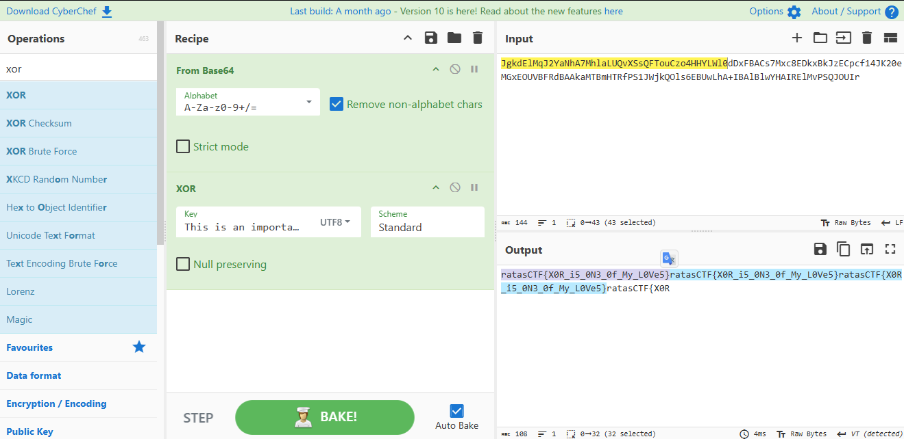

# 📝 Writeup – Lover's s3cret


## 🛠️ Tools Used / Herramientas Utilizadas

- CypherChef or Phyton3
- XOR
- Base64

## 🔎 Step by Step / Paso a Paso

1. **ES:** Paso 1 – Analizar el código proporcionado y notar que primero se aplica un XOR repetitivo con la clave al texto original y luego se codifica el resultado en Base64.  
   **EN:** Step 1 – Analyze the provided code and observe that a repeating XOR is applied to the original text, followed by Base64 encoding.

``` Python
import base64

plaintext = "This is an important secret, no one should know, do not go to the third floor of the social sciences library"
key = "" # I have lost the key!

def byte_xor(plaintext_bytes, key_bytes):
    output = []
    key_index = 0
    for b in plaintext_bytes:
        output.append(b ^ key_bytes[key_index])
        key_index = (key_index + 1) % len(key_bytes)
    return bytes(output)

ciphertext_b64 = base64.b64encode(byte_xor(plaintext.encode('utf-8'), key.encode('utf-8')))

ciphertext_decoded = base64.b64decode("JgkdElMqJ2YaNhA7MhlaLUQvXSsQFTouCzo4HHYLWl0dDxFBACs7Mxc8EDkxBkJzECpcf14JK20eMGxEOUVBFRdBAAkaMTBmHTRfPS1JWjkQOls6EBUwLhA+IBAlBlwYHAIRElMvPSQJOUIr")

print(ciphertext_decoded)
```

2. **ES:** Paso 2 – En CyberChef, aplicar la operación contraria: decodificar el texto cifrado desde Base64 para recuperar los bytes XORed.  
   **EN:** Step 2 – In CyberChef, apply the reverse operation: decode the encrypted text from Base64 to recover the XORed bytes.

3. **ES:** Paso 3 – Observar que los bytes resultantes son ilegibles; esto confirma que todavía están cifrados con XOR.  
   **EN:** Step 3 – Notice that the resulting bytes are unreadable; this confirms they are still XOR-encrypted.

4. **ES:** Paso 4 – Aplicar un XOR sobre los bytes decodificados usando como “clave” el mensaje original conocido (plaintext), aprovechando la propiedad de XOR: `ciphertext XOR plaintext = key`.  
   **EN:** Step 4 – Apply an XOR on the decoded bytes using the known original message (plaintext) as the “key,” taking advantage of the XOR property: `ciphertext XOR plaintext = key`.



5. **ES:** Paso 5 – Verificar que la clave obtenida es válida reproduciendo el ciphertext original al aplicar la operación inicial de XOR y luego Base64.  
   **EN:** Step 5 – Verify that the recovered key is valid by reproducing the original ciphertext via the initial XOR and Base64 operations.


6. **ES:** Paso 6 – Extraer el mensaje secreto (plaintext) como resultado final del reto.  
   **EN:** Step 6 – Extract the secret message (plaintext) as the final result of the challenge.


## 🚩 Flag
`ratasCTF{X0R_i5_0N3_0f_My_L0Ve5}`  
